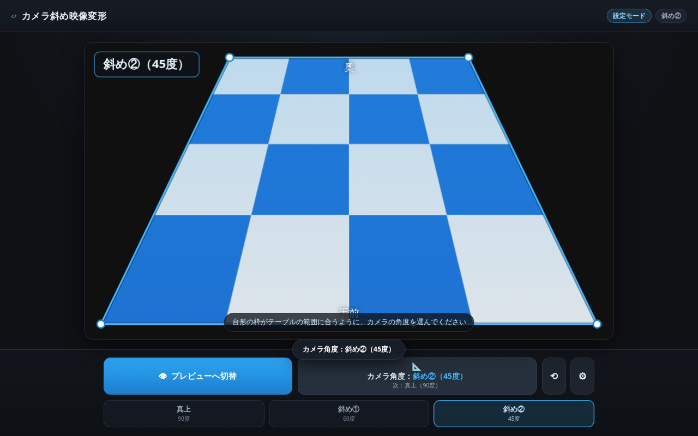
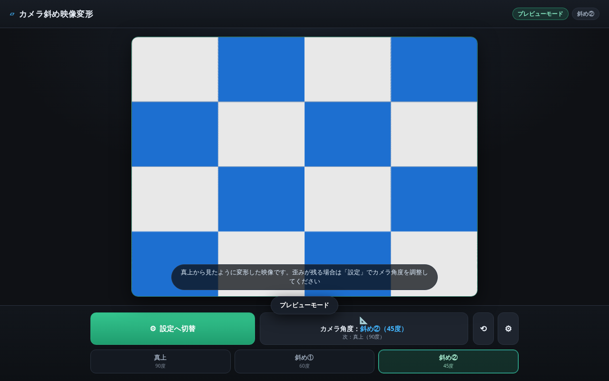
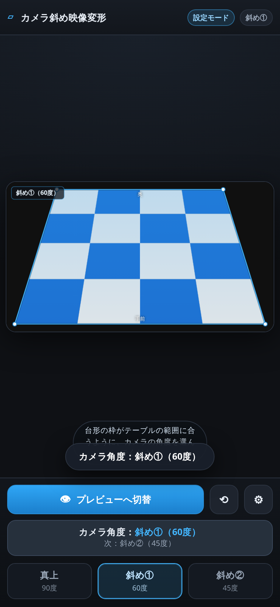
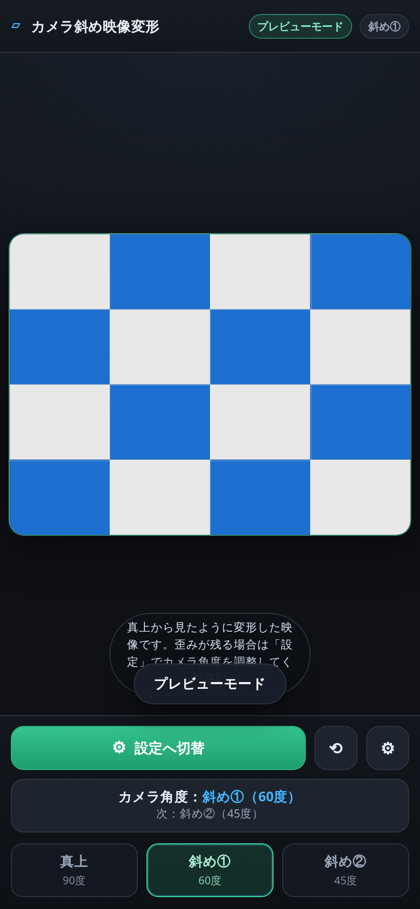
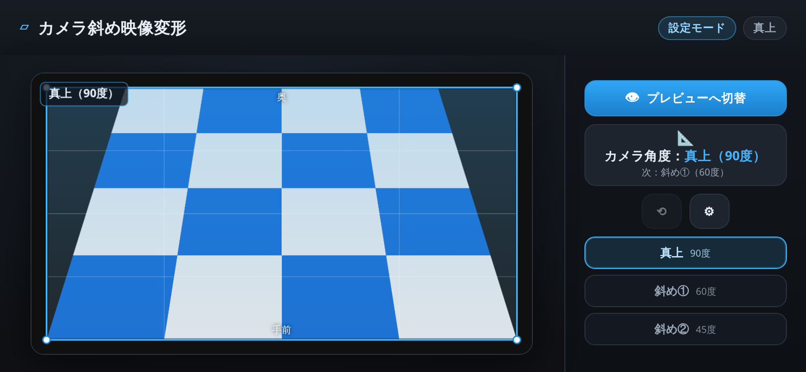
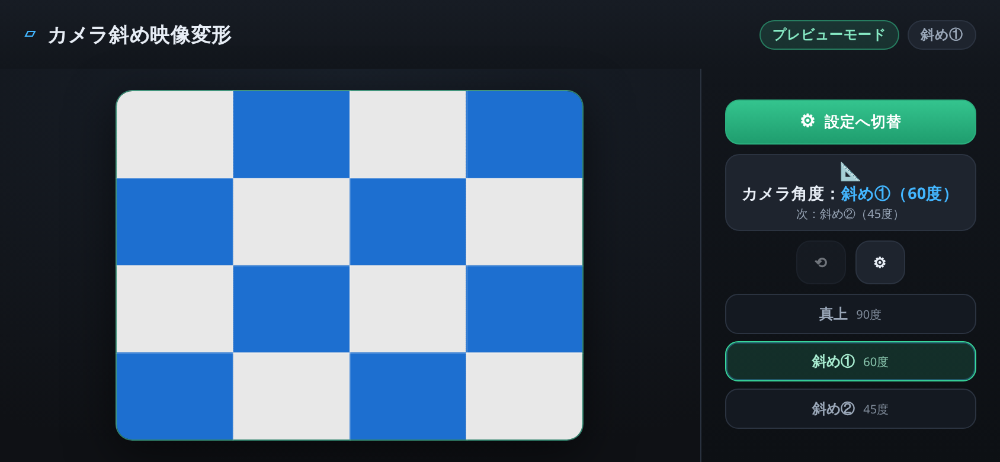

# カメラ斜め映像変形

Web カメラやスマートフォンのカメラで **テーブルを斜め上から映している映像** を、
**真上から映しているような映像** にリアルタイム変形して表示する Web アプリです。

PC・スマートフォンの両方に対応しています。

---

## 画面

### 設定モード（PC）
現在のカメラ角度に対応する半透明の台形イメージが映像に重なります。



### プレビューモード（PC）
台形が長方形に戻り、平面＝真上から見た映像として表示されます。



### スマートフォン（縦）

| 設定モード | プレビューモード |
|---|---|
|  |  |

### スマートフォン（横）

回転すると操作系が右カラムへ移り、映像の高さを最大限に使います。

| 設定モード | プレビューモード |
|---|---|
|  |  |

---

## 要件への対応

| 資料の要件 | 実装 |
|---|---|
| 「設定」モードと「プレビュー」モードを設ける | 2 モード構成。ヘッダーのチップで現在のモードを常時表示 |
| 最初は「設定」モードで始まり、ボタンで切り替える | 起動時は必ず設定モード。**モード切替ボタン 1 つ**（`プレビューへ切替` ⇄ `設定へ切替`）でトグル |
| 「設定」では、カメラの角度は真上・斜め①（60度）・斜め②（45度）の 3 段階を順番に切り替える。切替ボタンは 1 つで、押す度に角度が変わる | **角度切替ボタン 1 つ**。押す度に `真上 → 斜め①（60度）→ 斜め②（45度）→ 真上 …` と循環。ボタン内に「次に切り替わる角度」も表示 |
| 現在の角度が分かるように、半透明の台形イメージを被せる | 選択中の角度から算出した台形を半透明で重畳。外側を暗く落とし、内部グリッド・四隅ハンドル・角度ラベル・奥／手前の向きも表示。3 段階インジケーターでも現在位置が分かる |
| 「プレビュー」は平面に見えるように変形させた映像を表示する | 射影変換（ホモグラフィ）で台形を長方形に戻した映像を表示 |

---

## 変形の原理

テーブル面は平面なので、その像は平面 → 像平面の **射影変換（homography）** で表せます。
射影変換は 4 組の対応点で一意に決まるため、「映像内でテーブルが写っている四隅」が分かれば
それを長方形に戻す変換が確定します。

カメラ高さ `h`、焦点距離 `f`、鉛直からの傾き `φ` のとき、テーブル面上の点 `(X, Y)` の像座標は

```
u =  f·X / (Y·sinφ + h/cosφ)
v = -f·Y·cosφ / (Y·sinφ + h/cosφ)
```

となります。ここに `v = tanβ`（光軸からの垂直視野角）を代入して整理すると、
その行での半幅は

```
u(β) ∝ cosφ · (1 + tanβ·tanφ)
```

という簡単な形になります。テーブルが垂直視野角 `±α` を占めるとして `p = tanα` とおくと、

| | 半幅 |
|---|---|
| 上辺（奥） | `∝ 1 − p·tanφ` |
| 下辺（手前） | `∝ 1 + p·tanφ` |

したがって上辺 / 下辺のテーパー比は

```
taper = (1 − p·tanφ) / (1 + p·tanφ)
```

の 1 式で決まります。`φ = 0`（真上）では `taper = 1` となり長方形＝変形なしに戻ります。

| カメラ角度 | 鉛直からの傾き φ | テーパー比（p = 0.35） |
|---|---|---|
| 真上（90度） | 0° | 1.000（長方形） |
| 斜め①（60度） | 30° | 0.664 |
| 斜め②（45度） | 45° | 0.482 |

求めた台形四隅から `squareToQuad()` で 3×3 行列を作り、
**出力長方形の各画素 →（行列）→ 入力映像の画素** を引くことで変形後の映像を得ます。

---

## 描画方式

プレビューの描画は 2 系統を自動で切り替えます。

| 方式 | 内容 | 使用条件 |
|---|---|---|
| **WebGL 射影変換** | フラグメントシェーダで画素ごとに厳密な射影変換を行う。高品質・高速 | WebGL が使える場合（既定） |
| **Canvas 2D スライス** | 出力を 160 本の水平スライスに分割し、対応する入力の帯を `drawImage()` で引き伸ばす | WebGL が使えない場合に自動フォールバック |

どちらの方式でも、台形に貼った市松模様が正方格子へ復元されることをテストで確認しています（16/16 セル一致）。
現在どちらで描画しているかは「詳細設定 → 変形方式」で確認できます。

---

## 操作方法

1. HTTPS または `localhost` でページを開く（`getUserMedia` の要件）
2. **カメラを開始** をタップ／クリックし、カメラの使用を許可する
3. 設定モードで、半透明の台形枠が **テーブルの範囲に合う** ようにカメラ角度ボタンを押して選ぶ
4. **プレビューへ切替** を押すと、真上から見たような映像が表示される

### 詳細設定（⚙ ボタン）

| 項目 | 説明 |
|---|---|
| カメラ | 複数カメラがある場合に選択（⟲ ボタンでも順送りで切替） |
| 台形の強さ | テーブルが写っている奥行き量 `p`。大きいほど台形の傾きが強くなる（0.10〜0.70） |
| 枠の上下位置 | 台形枠の垂直オフセット（−40〜+40%） |
| 出力の縦横比 | プレビューの縦横比（4:3 / 16:9 / 3:2 / 1:1 / 3:4） |
| 左右反転 | フロントカメラ使用時などのミラー表示 |
| ガイドグリッド | 設定・プレビューにガイド線を表示 |
| PNG 保存 | 現在表示中の映像を画像として保存 |
| 情報表示 | 状態・入力解像度・fps・変形方式 |

設定は `localStorage` に保存され、次回アクセス時に復元されます。

### キーボードショートカット（PC）

| キー | 動作 |
|---|---|
| `Space` / `P` | モード切替 |
| `A` / `→` | 角度を次へ |
| `←` | 角度を前へ |
| `1` `2` `3` | 真上／斜め①／斜め② を直接指定 |
| `Esc` | 詳細設定を閉じる |

画面のダブルクリック（ダブルタップ）でもモードを切り替えられます。

---

## PC / スマートフォン対応

| 対応内容 | 詳細 |
|---|---|
| レイアウト | 1 画面に収まる固定レイアウト（スクロールなし）。映像領域が可変 |
| PC（1000px 以上） | 詳細設定は右サイドドロワー。本体は左に寄って映像が隠れない |
| スマートフォン縦 | 詳細設定はボトムシート。主要ボタンを 2 段にして文字が折り返さないよう配置 |
| スマートフォン横 | **操作系を右カラムへ移動**して映像の高さを最大化（後述） |
| タップ領域 | 主要ボタンは 44px 以上を確保 |
| カメラ解像度 | 端末の向きに応じて縦長／横長を要求し、余白が出ないようにする |
| 表示サイズ | キャンバスの CSS サイズを縦横比から JS で px 指定（`aspect-ratio` の非互換を回避） |
| iOS 対応 | `100dvh` ＋ `--vh` 併用、`env(safe-area-inset-*)`、`playsinline`、`muted` 自動再生 |
| その他 | `prefers-reduced-motion` の尊重、タブ非表示時の描画停止 |

---

## 画面回転への対応

スマートフォンの回転時に、次の 2 点を処理しています。

### 1. レイアウトの切り替え

縦向けのまま縦積みレイアウトを使うと、横向きでは高さ 390px 前後のうち
ヘッダーと操作バーで 200px 以上を消費し、映像領域が極端に狭くなります
（実測で**ステージ占有率 12%**）。

そこで横向きでは **CSS Grid で操作系を右カラムへ移し**、映像に高さをすべて使わせます。
角度の 3 段階インジケーターも縦並びに切り替えます。

| | 縦積み（修正前） | 右カラム（修正後） |
|---|---|---|
| iPhone 14 横 | 12% | **95%** |
| iPhone 14 PM 横 | 37% | **94%** |

### 2. カメラの向きの追従

端末のカメラは **起動時の向きの解像度で固定される** ため、回転しても映像は
縦長（または横長）のままで、ステージに大きな余白が残ります。

そこで `track.applyConstraints()` でトラックを向きに合わせて再構成します。
ストリームを張り替えないため **映像が途切れず、カメラ権限も再要求されません**。
非対応の端末では従来どおり contain 表示へフォールバックします。

### 回転の検知

端末・ブラウザによって発火するイベントが異なるため、複数の経路を併用し、
最終的に同じ再レイアウト処理へ集約しています。

| 経路 | 用途 |
|---|---|
| `resize` | 最も確実。PC のウィンドウ操作もここ |
| `orientationchange` | iOS Safari では `resize` より先に発火 |
| `screen.orientation` の `change` | 新しい標準イベント |
| `visualViewport` の `resize` | iOS のアドレスバー伸縮・ピンチズーム |

回転直後は端末が報告するサイズがまだ古いことがあるため（特に iOS Safari）、
`0 / 80 / 200 / 420 / 700ms` の複数回に分けて再計測します。
また連続する `resize` は `requestAnimationFrame` でまとめ、無駄な再描画を防いでいます。

回転してもモード・角度・各種設定はすべて保持されます。

---

## ファイル構成

```
index.html              画面構造
css/
  style.css             スタイル（ダークテーマ・レスポンシブ）
js/
  geometry.js           台形四隅の算出と射影変換行列の計算
  renderer.js           SetupRenderer（台形オーバーレイ）/ PreviewRenderer（WebGL・2D）
  app.js                カメラ制御・モード／角度管理・描画ループ・UI
tests/
  e2e_test.py              E2E テスト（Playwright、45 項目）
  rotation_test.py         画面回転テスト（42 項目）
  viewport_sweep_test.py   主要端末 9 パターンの総点検
  fallback_test.py         Canvas 2D フォールバックの検証
docs/                      README 用スクリーンショット
```

---

## テスト

`canvas.captureStream()` で「台形に市松模様を貼った仮想カメラ映像」を作り、
`getUserMedia` を差し替えて実ブラウザ（Chromium）で検証します。
プレビュー結果の画素を読み出し、**市松模様が正方格子に復元されているか** を自動判定します。

```bash
# サーバーを起動
python3 -m http.server 3000

# 別シェルで実行
pip install playwright
python3 -m playwright install --with-deps chromium

python3 tests/e2e_test.py              # 45 項目（PC / スマホ縦 / スマホ横）
python3 tests/rotation_test.py         # 42 項目（画面回転）
python3 tests/viewport_sweep_test.py   # 主要端末 9 パターン
python3 tests/fallback_test.py         # Canvas 2D フォールバック
```

検証範囲:

- 初期状態が設定モード・真上であること
- 半透明の台形オーバーレイが描かれていること
- 角度ボタンが `真上 → 斜め① → 斜め② → 真上` と循環すること
- モードボタンでキャンバスとラベルが入れ替わること
- **台形 → 正方格子への復元精度**（WebGL / Canvas 2D 両方で 16/16 一致）
- 詳細設定（台形の強さ・縦横比・リセット）の反映
- `localStorage` への保存
- PC / スマホ縦 / スマホ横で 1 画面に収まり、横スクロールが出ないこと
- タップ領域サイズ、パネルの表示形態（ドロワー／ボトムシート）
- 全ビューポートで JS エラーが発生しないこと

### 画面回転テスト（`rotation_test.py`）の検証範囲

| 項目 | 内容 |
|---|---|
| 縦起動 → 横回転 | レイアウト・ステージ占有率・スクロールの有無 |
| 横起動 → 縦回転 | 同上（起動時の向きが逆のケース） |
| カメラの再構成 | 回転で縦長 ⇄ 横長に切り替わること |
| 状態の保持 | 回転してもモード・角度が変わらないこと |
| 変形の正しさ | 回転後も正方格子に復元されること |
| 連続回転 | 5 往復してもレイアウトが破綻しないこと |
| パネル表示中の回転 | パネルが画面内に収まり操作できること |

### 端末総点検（`viewport_sweep_test.py`）の結果

| 端末 | ステージ占有率 |
|---|---|
| iPhone SE 縦（320×568） | 60% |
| iPhone SE 横（568×320） | 70% |
| iPhone 14 縦（390×844） | 90% |
| iPhone 14 横（844×390） | 95% |
| iPhone 14 Pro Max 横（932×430） | 94% |
| Pixel 7 縦（412×915） | 95% |
| iPad mini 縦（744×1133） | 70% |
| iPad Pro 横（1366×1024） | 97% |
| PC（1440×900） | 82% |

---

## 動作環境

| 項目 | 内容 |
|---|---|
| ブラウザ | Chrome / Edge / Firefox / Safari（いずれも最新版） |
| プロトコル | **HTTPS** または `localhost`（`getUserMedia` の要件） |
| 必要 API | MediaDevices API、Canvas 2D API |
| 推奨 | WebGL（無い場合は Canvas 2D へ自動フォールバック） |
| 依存ライブラリ | なし（バニラ JS） |

---

## 補足

- カメラ角度は資料どおり **真上・60度・45度の 3 段階プリセット** です。
  実際の設置と台形枠がずれる場合は「台形の強さ」「枠の上下位置」で微調整できます。
- 斜めから見た映像を引き伸ばす方式のため、**奥側（上辺）は元の画素が少なく解像感が低下** します。
  これは原理上避けられないもので、傾きが大きいほど顕著になります。
